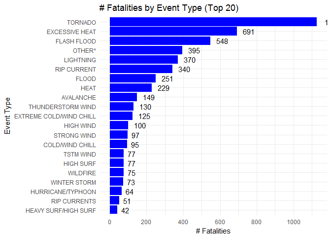

## Synopsis


```r
library(ggplot2)
library(dplyr)
```

```
## Warning: package 'dplyr' was built under R version 3.4.3
```

```
## 
## Attaching package: 'dplyr'
```

```
## The following objects are masked from 'package:stats':
## 
##     filter, lag
```

```
## The following objects are masked from 'package:base':
## 
##     intersect, setdiff, setequal, union
```

```r
library(plyr)
```

```
## -------------------------------------------------------------------------
```

```
## You have loaded plyr after dplyr - this is likely to cause problems.
## If you need functions from both plyr and dplyr, please load plyr first, then dplyr:
## library(plyr); library(dplyr)
```

```
## -------------------------------------------------------------------------
```

```
## 
## Attaching package: 'plyr'
```

```
## The following objects are masked from 'package:dplyr':
## 
##     arrange, count, desc, failwith, id, mutate, rename, summarise,
##     summarize
```

```r
library(data.table)
```

```
## Warning: package 'data.table' was built under R version 3.4.4
```

```
## 
## Attaching package: 'data.table'
```

```
## The following objects are masked from 'package:dplyr':
## 
##     between, first, last
```

```r
library(grid)
```

## Data Processing

First, read in the US NOAA storm database located here:  https://d396qusza40orc.cloudfront.net/repdata%2Fdata%2FStormData.csv.bz2

Then unzip the .csv into the working /data directory and read into the storms data frame.


```r
# set working & create data directory
setwd("C:\\Users\\dabradford\\Desktop\\Coursera\\DataSci\\Reproducible\\RepData_PeerAssessment2")
if(!file.exists("./data")){dir.create("./data")}

# download storm data
get.data.project <- "https://d396qusza40orc.cloudfront.net/repdata%2Fdata%2FStormData.csv.bz2"
download.file(get.data.project,destfile="./data/storm_data.csv.bz2",method="auto")

zipfile.data = "storm_data.csv.bz2"

# make sure the data is in the working directory if not download the zip file into the to zipfile.data and unzip it
if(!file.exists(zipfile.data)) {        
    unzip(zipfile="./data/storm_data.csv.bz2",exdir="./data")
} 
```

```
## Warning in unzip(zipfile = "./data/storm_data.csv.bz2", exdir = "./data"):
## error 1 in extracting from zip file
```

```r
path_act <- file.path("./data" , "./data/storm_data")
files<-list.files(path_act, recursive=TRUE)

# Read data file > THIS WILL TAKE A WHILE
storms_raw <- read.csv("./data/storm_data.csv.bz2")


# inspect data file
str(storms_raw)
```

```
## 'data.frame':	902297 obs. of  37 variables:
##  $ STATE__   : num  1 1 1 1 1 1 1 1 1 1 ...
##  $ BGN_DATE  : Factor w/ 16335 levels "1/1/1966 0:00:00",..: 6523 6523 4242 11116 2224 2224 2260 383 3980 3980 ...
##  $ BGN_TIME  : Factor w/ 3608 levels "00:00:00 AM",..: 272 287 2705 1683 2584 3186 242 1683 3186 3186 ...
##  $ TIME_ZONE : Factor w/ 22 levels "ADT","AKS","AST",..: 7 7 7 7 7 7 7 7 7 7 ...
##  $ COUNTY    : num  97 3 57 89 43 77 9 123 125 57 ...
##  $ COUNTYNAME: Factor w/ 29601 levels "","5NM E OF MACKINAC BRIDGE TO PRESQUE ISLE LT MI",..: 13513 1873 4598 10592 4372 10094 1973 23873 24418 4598 ...
##  $ STATE     : Factor w/ 72 levels "AK","AL","AM",..: 2 2 2 2 2 2 2 2 2 2 ...
##  $ EVTYPE    : Factor w/ 985 levels "   HIGH SURF ADVISORY",..: 834 834 834 834 834 834 834 834 834 834 ...
##  $ BGN_RANGE : num  0 0 0 0 0 0 0 0 0 0 ...
##  $ BGN_AZI   : Factor w/ 35 levels "","  N"," NW",..: 1 1 1 1 1 1 1 1 1 1 ...
##  $ BGN_LOCATI: Factor w/ 54429 levels "","- 1 N Albion",..: 1 1 1 1 1 1 1 1 1 1 ...
##  $ END_DATE  : Factor w/ 6663 levels "","1/1/1993 0:00:00",..: 1 1 1 1 1 1 1 1 1 1 ...
##  $ END_TIME  : Factor w/ 3647 levels ""," 0900CST",..: 1 1 1 1 1 1 1 1 1 1 ...
##  $ COUNTY_END: num  0 0 0 0 0 0 0 0 0 0 ...
##  $ COUNTYENDN: logi  NA NA NA NA NA NA ...
##  $ END_RANGE : num  0 0 0 0 0 0 0 0 0 0 ...
##  $ END_AZI   : Factor w/ 24 levels "","E","ENE","ESE",..: 1 1 1 1 1 1 1 1 1 1 ...
##  $ END_LOCATI: Factor w/ 34506 levels "","- .5 NNW",..: 1 1 1 1 1 1 1 1 1 1 ...
##  $ LENGTH    : num  14 2 0.1 0 0 1.5 1.5 0 3.3 2.3 ...
##  $ WIDTH     : num  100 150 123 100 150 177 33 33 100 100 ...
##  $ F         : int  3 2 2 2 2 2 2 1 3 3 ...
##  $ MAG       : num  0 0 0 0 0 0 0 0 0 0 ...
##  $ FATALITIES: num  0 0 0 0 0 0 0 0 1 0 ...
##  $ INJURIES  : num  15 0 2 2 2 6 1 0 14 0 ...
##  $ PROPDMG   : num  25 2.5 25 2.5 2.5 2.5 2.5 2.5 25 25 ...
##  $ PROPDMGEXP: Factor w/ 19 levels "","-","?","+",..: 17 17 17 17 17 17 17 17 17 17 ...
##  $ CROPDMG   : num  0 0 0 0 0 0 0 0 0 0 ...
##  $ CROPDMGEXP: Factor w/ 9 levels "","?","0","2",..: 1 1 1 1 1 1 1 1 1 1 ...
##  $ WFO       : Factor w/ 542 levels ""," CI","$AC",..: 1 1 1 1 1 1 1 1 1 1 ...
##  $ STATEOFFIC: Factor w/ 250 levels "","ALABAMA, Central",..: 1 1 1 1 1 1 1 1 1 1 ...
##  $ ZONENAMES : Factor w/ 25112 levels "","                                                                                                               "| __truncated__,..: 1 1 1 1 1 1 1 1 1 1 ...
##  $ LATITUDE  : num  3040 3042 3340 3458 3412 ...
##  $ LONGITUDE : num  8812 8755 8742 8626 8642 ...
##  $ LATITUDE_E: num  3051 0 0 0 0 ...
##  $ LONGITUDE_: num  8806 0 0 0 0 ...
##  $ REMARKS   : Factor w/ 436781 levels "","-2 at Deer Park\n",..: 1 1 1 1 1 1 1 1 1 1 ...
##  $ REFNUM    : num  1 2 3 4 5 6 7 8 9 10 ...
```

```r
summary(storms_raw)
```

```
##     STATE__                  BGN_DATE             BGN_TIME     
##  Min.   : 1.0   5/25/2011 0:00:00:  1202   12:00:00 AM: 10163  
##  1st Qu.:19.0   4/27/2011 0:00:00:  1193   06:00:00 PM:  7350  
##  Median :30.0   6/9/2011 0:00:00 :  1030   04:00:00 PM:  7261  
##  Mean   :31.2   5/30/2004 0:00:00:  1016   05:00:00 PM:  6891  
##  3rd Qu.:45.0   4/4/2011 0:00:00 :  1009   12:00:00 PM:  6703  
##  Max.   :95.0   4/2/2006 0:00:00 :   981   03:00:00 PM:  6700  
##                 (Other)          :895866   (Other)    :857229  
##    TIME_ZONE          COUNTY           COUNTYNAME         STATE       
##  CST    :547493   Min.   :  0.0   JEFFERSON :  7840   TX     : 83728  
##  EST    :245558   1st Qu.: 31.0   WASHINGTON:  7603   KS     : 53440  
##  MST    : 68390   Median : 75.0   JACKSON   :  6660   OK     : 46802  
##  PST    : 28302   Mean   :100.6   FRANKLIN  :  6256   MO     : 35648  
##  AST    :  6360   3rd Qu.:131.0   LINCOLN   :  5937   IA     : 31069  
##  HST    :  2563   Max.   :873.0   MADISON   :  5632   NE     : 30271  
##  (Other):  3631                   (Other)   :862369   (Other):621339  
##                EVTYPE         BGN_RANGE           BGN_AZI      
##  HAIL             :288661   Min.   :   0.000          :547332  
##  TSTM WIND        :219940   1st Qu.:   0.000   N      : 86752  
##  THUNDERSTORM WIND: 82563   Median :   0.000   W      : 38446  
##  TORNADO          : 60652   Mean   :   1.484   S      : 37558  
##  FLASH FLOOD      : 54277   3rd Qu.:   1.000   E      : 33178  
##  FLOOD            : 25326   Max.   :3749.000   NW     : 24041  
##  (Other)          :170878                      (Other):134990  
##          BGN_LOCATI                  END_DATE             END_TIME     
##               :287743                    :243411              :238978  
##  COUNTYWIDE   : 19680   4/27/2011 0:00:00:  1214   06:00:00 PM:  9802  
##  Countywide   :   993   5/25/2011 0:00:00:  1196   05:00:00 PM:  8314  
##  SPRINGFIELD  :   843   6/9/2011 0:00:00 :  1021   04:00:00 PM:  8104  
##  SOUTH PORTION:   810   4/4/2011 0:00:00 :  1007   12:00:00 PM:  7483  
##  NORTH PORTION:   784   5/30/2004 0:00:00:   998   11:59:00 PM:  7184  
##  (Other)      :591444   (Other)          :653450   (Other)    :622432  
##    COUNTY_END COUNTYENDN       END_RANGE           END_AZI      
##  Min.   :0    Mode:logical   Min.   :  0.0000          :724837  
##  1st Qu.:0    NA's:902297    1st Qu.:  0.0000   N      : 28082  
##  Median :0                   Median :  0.0000   S      : 22510  
##  Mean   :0                   Mean   :  0.9862   W      : 20119  
##  3rd Qu.:0                   3rd Qu.:  0.0000   E      : 20047  
##  Max.   :0                   Max.   :925.0000   NE     : 14606  
##                                                 (Other): 72096  
##            END_LOCATI         LENGTH              WIDTH         
##                 :499225   Min.   :   0.0000   Min.   :   0.000  
##  COUNTYWIDE     : 19731   1st Qu.:   0.0000   1st Qu.:   0.000  
##  SOUTH PORTION  :   833   Median :   0.0000   Median :   0.000  
##  NORTH PORTION  :   780   Mean   :   0.2301   Mean   :   7.503  
##  CENTRAL PORTION:   617   3rd Qu.:   0.0000   3rd Qu.:   0.000  
##  SPRINGFIELD    :   575   Max.   :2315.0000   Max.   :4400.000  
##  (Other)        :380536                                         
##        F               MAG            FATALITIES          INJURIES        
##  Min.   :0.0      Min.   :    0.0   Min.   :  0.0000   Min.   :   0.0000  
##  1st Qu.:0.0      1st Qu.:    0.0   1st Qu.:  0.0000   1st Qu.:   0.0000  
##  Median :1.0      Median :   50.0   Median :  0.0000   Median :   0.0000  
##  Mean   :0.9      Mean   :   46.9   Mean   :  0.0168   Mean   :   0.1557  
##  3rd Qu.:1.0      3rd Qu.:   75.0   3rd Qu.:  0.0000   3rd Qu.:   0.0000  
##  Max.   :5.0      Max.   :22000.0   Max.   :583.0000   Max.   :1700.0000  
##  NA's   :843563                                                           
##     PROPDMG          PROPDMGEXP        CROPDMG          CROPDMGEXP    
##  Min.   :   0.00          :465934   Min.   :  0.000          :618413  
##  1st Qu.:   0.00   K      :424665   1st Qu.:  0.000   K      :281832  
##  Median :   0.00   M      : 11330   Median :  0.000   M      :  1994  
##  Mean   :  12.06   0      :   216   Mean   :  1.527   k      :    21  
##  3rd Qu.:   0.50   B      :    40   3rd Qu.:  0.000   0      :    19  
##  Max.   :5000.00   5      :    28   Max.   :990.000   B      :     9  
##                    (Other):    84                     (Other):     9  
##       WFO                                       STATEOFFIC    
##         :142069                                      :248769  
##  OUN    : 17393   TEXAS, North                       : 12193  
##  JAN    : 13889   ARKANSAS, Central and North Central: 11738  
##  LWX    : 13174   IOWA, Central                      : 11345  
##  PHI    : 12551   KANSAS, Southwest                  : 11212  
##  TSA    : 12483   GEORGIA, North and Central         : 11120  
##  (Other):690738   (Other)                            :595920  
##                                                                                                                                                                                                     ZONENAMES     
##                                                                                                                                                                                                          :594029  
##                                                                                                                                                                                                          :205988  
##  GREATER RENO / CARSON CITY / M - GREATER RENO / CARSON CITY / M                                                                                                                                         :   639  
##  GREATER LAKE TAHOE AREA - GREATER LAKE TAHOE AREA                                                                                                                                                       :   592  
##  JEFFERSON - JEFFERSON                                                                                                                                                                                   :   303  
##  MADISON - MADISON                                                                                                                                                                                       :   302  
##  (Other)                                                                                                                                                                                                 :100444  
##     LATITUDE      LONGITUDE        LATITUDE_E     LONGITUDE_    
##  Min.   :   0   Min.   :-14451   Min.   :   0   Min.   :-14455  
##  1st Qu.:2802   1st Qu.:  7247   1st Qu.:   0   1st Qu.:     0  
##  Median :3540   Median :  8707   Median :   0   Median :     0  
##  Mean   :2875   Mean   :  6940   Mean   :1452   Mean   :  3509  
##  3rd Qu.:4019   3rd Qu.:  9605   3rd Qu.:3549   3rd Qu.:  8735  
##  Max.   :9706   Max.   : 17124   Max.   :9706   Max.   :106220  
##  NA's   :47                      NA's   :40                     
##                                            REMARKS           REFNUM      
##                                                :287433   Min.   :     1  
##                                                : 24013   1st Qu.:225575  
##  Trees down.\n                                 :  1110   Median :451149  
##  Several trees were blown down.\n              :   568   Mean   :451149  
##  Trees were downed.\n                          :   446   3rd Qu.:676723  
##  Large trees and power lines were blown down.\n:   432   Max.   :902297  
##  (Other)                                       :588295
```

This analysis specifically asks for the effects of storm events across the United States.  For this analysis we will not be considering geographical boundaries, such as county or state borders, and will include all geolocations included in the dataset.  Additionally, we will only be looking at the last ten years of data for our analysis to account for more recent trends and to ensure we are working with more accurate data points.  

Filter data to only include events from November 2001 through November 2011 based on the __BGN_DATE__ variable.


```r
# First convert BGN_DATE to date 
storms_raw$BGN_DATE <- as.Date(storms_raw$BGN_DATE, "%m/%d/%Y")

# Then parse only those events between Nov 2001 and Nov 2011 to get the last ten years of data.  Also only include the variables that will help us understand consequences to population health (FATALITIES & INJURIES) and/or economics (PROPDMG &  CROPDMG)

storms_10yr  <- storms_raw %>%
    
    filter(BGN_DATE >= "2001-11-01" & BGN_DATE <= "2011-11-30")
```

```
## Warning: package 'bindrcpp' was built under R version 3.4.4
```

We need to understand the dataset better since there isn't clear documentation of what some of the variable contents signify.  Let's view a few events in Georgia


```r
# view one event to determine variable meanings
ga_events  <- storms_raw %>%
    select(BGN_DATE, STATE, EVTYPE, FATALITIES, INJURIES, PROPDMG, PROPDMGEXP, CROPDMG, CROPDMGEXP) %>%
    filter(BGN_DATE == "2007-03-01" & EVTYPE == "TORNADO" & STATE == "GA")

head(ga_events)
```

```
##     BGN_DATE STATE  EVTYPE FATALITIES INJURIES PROPDMG PROPDMGEXP CROPDMG
## 1 2007-03-01    GA TORNADO          0        0     250          K       0
## 2 2007-03-01    GA TORNADO          0        0       1          K       0
## 3 2007-03-01    GA TORNADO          0        0     400          K       0
## 4 2007-03-01    GA TORNADO          1        4     500          K       0
## 5 2007-03-01    GA TORNADO          0        9     500          K       0
## 6 2007-03-01    GA TORNADO          0        0      25          K       0
##   CROPDMGEXP
## 1          K
## 2          K
## 3          K
## 4          K
## 5          K
## 6          K
```

Based on this analysis and comparing to the NOAA Storm Events database search page at the link below we understand the following:

__FATALITIES__ - Number of people killed as a direct result of the event
__INJURIES__ - Number of people injured as a direct result of the event

__Property damage__ is found by combining PROPDMG and PROPDMGEXP variables.  Possible values for PROPDMGEXP include:

<blank> - no damage
0 - no damage
B - damage in billions USD.  For example, if PROPDMG = 5, and PROPDMG = 'B' then property damage is $5,000,000,000
K - damage in thousands USD
M - damage in millions USD

__Crop damage__ is calculated in the same way.

https://www.ncdc.noaa.gov/stormevents/choosedates.jsp?statefips=-999%2CALL


```r
count(storms_10yr, 'PROPDMGEXP')
```

```
##   PROPDMGEXP   freq
## 1            142850
## 2          0      1
## 3          B     27
## 4          K 307753
## 5          M   4954
```

```r
count(storms_10yr, 'CROPDMGEXP')
```

```
##   CROPDMGEXP   freq
## 1            187571
## 2          B      4
## 3          K 266979
## 4          M   1031
```
 
Therefore we need to add to new variables to account for property and crop damage.


```r
# Property damage
storms_10yr <- mutate(storms_10yr,
                      prop.dmg = ifelse(PROPDMGEXP == "K", PROPDMG * 1000,
                                        ifelse(PROPDMGEXP == "M", PROPDMG * 1000000,
                                               ifelse(PROPDMGEXP == "B", PROPDMG * 1000000000, 0))))
# Crop damage
storms_10yr <- mutate(storms_10yr,
                      crop.dmg = ifelse(CROPDMGEXP == "K", CROPDMG * 1000,
                                        ifelse(CROPDMGEXP == "M", CROPDMG * 1000000,
                                               ifelse(CROPDMGEXP == "B", CROPDMG * 1000000000, 0))))
```

Since there are 128 event types we wanted to plot the top 20 and categorize all other events as "OTHER".


```r
top10fatalities <- data.table(storms_10yr)
top10fatalities <- top10fatalities[FATALITIES != 0 & !is.na(FATALITIES), sum(FATALITIES), by = EVTYPE]

top10fatalities <- top10fatalities[order(-rank(V1), EVTYPE)[21:nrow(top10fatalities)],EVTYPE:="OTHER*"]
top10fatalities <- top10fatalities[, sum(V1), by = EVTYPE]
top10fatalities$EVTYPE <- factor(top10fatalities$EVTYPE, levels = top10fatalities$EVTYPE[order(top10fatalities$V1)])
```


## Results

### Q1 - Across the United States, which types of events (as indicated in the EVTYPE variable) are most harmful with respect to population health?


```r
# create png device
png("plot1.png", width=960, height=480, units="px", bg="transparent")

plot1 <- ggplot(top10fatalities, aes(x=EVTYPE, y=V1)) + 
    geom_bar(stat="identity", fill="blue") +
    labs(x="Event Type", y="# Fatalities", title="# Fatalities by Event Type (Top 20)") +
    theme_minimal() +
    coord_flip() + 
    geom_text(aes(label=V1), size=4, position=position_dodge(width=1), hjust=-.5) +
    scale_y_continuous(breaks = seq(min(0), max(1500), by = 200)) 

# turn off device to ensure writing completes
dev.off()
```

```
## png 
##   2
```

```r
plot1
```

<!-- -->


### Q2 - Across the United States, which types of events have the greatest economic consequences?


## Appendix


